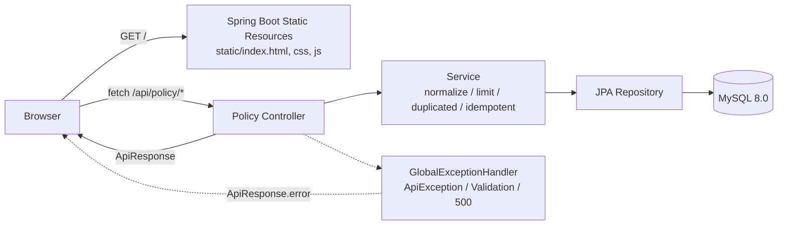
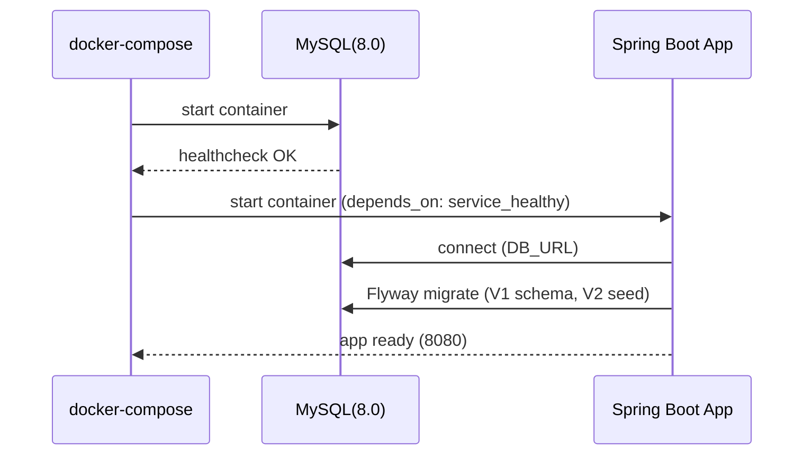

# ExtGuard - 파일 확장자 차단 정책 관리 (Attachment Policy Admin)

> 파일 업로드/첨부 기능에서 발생하기 쉬운 보안 리스크(실행 파일, 스크립트 등)를 줄이기 위해,
> 확장자 차단 정책을 관리하는 프로그램

## 목차
- [배포 주소](#배포-주소)
- [주요 고려사항](#주요-고려사항)
    - [Fixed vs Custom을 테이블로 분리한 이유](#1-fixed-vs-custom을-테이블로-분리한-이유)
    - [PATCH를 멱등 API로 설계한 이유](#2-patch를-멱등-api로-설계한-이유-toggle-금지)
    - [서버 사이드 검증을 서비스 계층에서 강제한 이유](#3-서버-사이드-검증을-서비스-계층에서-강제한-이유)
- [사용 기술](#사용-기술)
- [DB 스키마](#db-스키마)
- [아키텍처](#아키텍처)
- [실행 화면](#실행-화면)
- [API 명세](#api-명세)
- [로컬 실행 방법](#로컬-실행-방법)
- [로컬 API 테스트 (PowerShell)](#로컬-api-테스트-windows-powershell--invoke-restmethod)
- [조건 외 설계 항목 (구현 완료)](#조건-외-설계-항목-구현-완료)
- [진행 예정 사항](#진행-예정-사항-현재-미구현)

---

## 배포 주소

- http://54.243.57.149/

---

## 주요 고려사항

### 1) Fixed vs Custom을 테이블로 분리한 이유

확장자 정책은 성격이 서로 다른 두 종류가 섞이면 운영이 어려워진다고 생각하였습니다.

- **Fixed(고정 확장자)**
    - 기본 제공되는 표준 차단 후보군(제시된 조건 참고하여 추가)
    - 정책은 “존재 여부”가 아니라 blocked on/off 상태 변경이 핵심
    - 운영 중에도 목록 자체는 안정적으로 유지되는 것이 유리
- **Custom(커스텀 확장자)**
    - 운영자가 상황에 따라 추가/삭제하는 가변 정책
    - 정책은 목록의 추가와 삭제가 핵심
    - 삭제를 위해 식별자가 필요하므로 `id(PK)` 기반

따라서,
- Fixed는 `extension(PK)` + `blocked`로 “상태 관리”에 최적화
- Custom은 `id(PK)` + `extension(UNIQUE)`로 “목록 관리”에 최적화  

| 구분 | Fixed Extension | Custom Extension |
|---|---|---|
| 성격 | 제공되는 표준 목록 | 운영자가 추가하는 목록 |
| 주요 동작 | blocked 상태 변경 | 등록/삭제 |
| 키 설계 | extension이 PK | id(PK) + extension UNIQUE |
| 변경 추적 | updated_at 자동 갱신 | created_at 자동 생성 |

---

### 2) PATCH를 멱등 API로 설계한 이유 (toggle 금지)

고정 확장자 차단 여부는 UI에서 **체크박스**로 표현됩니다.  
체크박스는 “토글”이 아니라 “최종 상태”를 서버에 전달하는 것이 더 안정적이라고 생각했습니다.

- `PATCH /fixed-extensions/{extension}` 요청은 `{ "blocked": true/false }`로 **원하는 최종 상태를 명시**
- 동일 요청을 여러 번 보내도 결과가 동일(멱등)
- 네트워크 재시도, UI의 중복 이벤트, 탭 이동 등에서 “토글 API”는 상태가 꼬일 수 있어 금지했습니다.

---

### 3) 서버 사이드 검증을 서비스 계층에서 강제한 이유

Controller(입력 형식 검증)만으로는 정책 규칙을 안전하게 보장하기 어렵다고 생각했습니다.

- **정책 규칙(중복 금지, 최대 개수 제한, normalize 등)** 은 서비스 계층에서 강제해야
    - API 경로가 늘어나도 규칙이 분산되지 않고
    - UI/외부 호출자가 바뀌어도 일관된 결과를 유지합니다.

또한, Custom 확장자 등록은 다음을 고려했습니다.
- normalize( trim / lower / 앞의 '.' 제거 ) 후 저장 → 데이터 일관성 확보
- `existsByExtension()`로 사전 중복 체크(409)
- 동시에 들어오는 요청(레이스)까지 고려해,
    - DB의 UNIQUE 제약 위반(`DataIntegrityViolationException`)도 409로 매핑

---

## 사용 기술

| 구분        | 기술 | 버전 | 선택 이유 |
|-----------|---|---:|---|
| 언어        | Java | 21 | Spring Boot 3.x 기준의 최신 LTS 환경으로 개발/배포 일관성 확보 |
| 프레임워크     | Spring Boot | 3.5.10 | REST API + 정적 리소스 서빙을 단일 애플리케이션으로 구성 |
| 빌드        | Gradle Wrapper | 8.14.4 | 팀/환경 차이를 제거하고 동일 빌드 재현 |
| DB        | MySQL (Docker) | 8.0 | 운영에서 흔한 RDB + 컨테이너로 로컬/서버 환경 동일화 |
| ORM       | Spring Data JPA | (Boot BOM) | 단순 CRUD/정책 관리 도메인에 맞는 생산성 선택 |
| Migration | Flyway | (Boot BOM) | DDL/seed를 이력으로 관리해 배포 시점 재현 가능 |
| UI        | Vanilla HTML/CSS/JS | - | 요구 UI를 최소 구현, fetch로 동일 Origin API 호출 |
| 컨테이너      | Docker / Compose | - | 단일 EC2에서 app+db 구성 및 기동 자동화 |

---

## DB 스키마

### 1) fixed_extension

고정 확장자의 차단 여부를 저장합니다.  
목록 자체는 고정하고 `blocked` 상태만 변경하는 모델에 맞춰 `extension`을 PK로 사용했습니다.

| 컬럼 | 타입 | 제약 | 기본값/동작 | 설명 |
|---|---|---|---|---|
| extension | VARCHAR(20) | PK, NOT NULL | - | 고정 확장자 값 |
| blocked | TINYINT(1) | NOT NULL | DEFAULT 0 | 차단 여부 |
| updated_at | DATETIME(6) | NOT NULL | DEFAULT CURRENT_TIMESTAMP(6) + ON UPDATE | 상태 변경 시각(자동 갱신) |

<details>
<summary>DDL 보기</summary>

```sql
CREATE TABLE fixed_extension (
                               extension VARCHAR(20) NOT NULL,
                               blocked TINYINT(1) NOT NULL DEFAULT 0,
                               updated_at DATETIME(6) NOT NULL DEFAULT CURRENT_TIMESTAMP(6) ON UPDATE CURRENT_TIMESTAMP(6),
                               PRIMARY KEY (extension)
);
```
</details>

### 2) custom_extension

운영자가 추가하는 확장자 목록입니다.  
삭제/관리를 위해 `id`를 PK로 두고, 중복 등록 방지를 위해 `extension`에 UNIQUE 제약을 설정했습니다.

| 컬럼 | 타입 | 제약 | 기본값/동작 | 설명 |
|---|---|---|---|---|
| id | BIGINT | PK, AUTO_INCREMENT | - | 관리용 식별자 |
| extension | VARCHAR(20) | NOT NULL, UNIQUE | - | 커스텀 확장자 값 |
| created_at | DATETIME(6) | NOT NULL | DEFAULT CURRENT_TIMESTAMP(6) | 생성 시각(자동 생성) |

<details>
<summary>DDL 보기</summary>

```sql
CREATE TABLE custom_extension (
                                id BIGINT NOT NULL AUTO_INCREMENT,
                                extension VARCHAR(20) NOT NULL,
                                created_at DATETIME(6) NOT NULL DEFAULT CURRENT_TIMESTAMP(6),
                                PRIMARY KEY (id),
                                CONSTRAINT uk_custom_extension UNIQUE (extension)
);
```

</details> 


### Flyway 마이그레이션

`V1__create_tables.sql`: 테이블 생성

`V2__seed_fixed_extensions.sql`: 고정 확장자 seed 데이터 삽입

```sql
INSERT INTO fixed_extension (extension, blocked) VALUES
    ('exe', 0),
    ('sh', 0),
    ('bat', 0),
    ('cmd', 0),
    ('com', 0),
    ('cpl', 0),
    ('scr', 0),
    ('js', 0),
    ('jar', 0)
ON DUPLICATE KEY UPDATE blocked = VALUES(blocked);
```

## 아키텍처

### 1) 요청 흐름 (단일 Origin)

- 플로우차트


- 시퀀스 다이어그램



### 2) 배포 구성 (docker-compose)

```mermaid
flowchart TB
  U[User] -->|HTTP 80| EIP["Elastic IP (EIP)"]

  subgraph EC2BOX["EC2 Instance (Docker Engine)"]
    ENTRY["Host (EC2) :80"]
    ENTRY -->|80:8080| APP["extguard-app<br/>Spring Boot :8080"]

    subgraph NET["docker-compose network (bridge)"]
      APP -->|JDBC| MYSQL["extguard-mysql<br/>MySQL :3306 internal"]
      VOL[(extguard-mysql-data volume)] --> MYSQL
    end
  end

  EIP --> ENTRY

 ```

- 외부 공개 포트: 80만 공개

- DB(3306)는 외부 노출 제거 (내부 네트워크에서만 접근)

- `MySQL healthcheck` 후 App 기동 (`depends_on: condition: service_healthy`)

- 데이터 영속화: `extguard-mysql-data` volume 사용

## 실행 화면

[이미지 자리] 메인 화면(고정 확장자/커스텀 보드)

[이미지 자리] 고정 확장자 체크/해제 동작

[이미지 자리] 커스텀 확장자 추가/삭제 및 n/200 카운트

[이미지 자리] 에러 메시지 노출 예시(코드 숨김, message만 표시)

## API 명세

### Base Path

`/api/policy`

### 1) 고정 확장자 조회

- `GET /fixed-extensions`
- 응답 예시

  ```json
  {
    "status": 200,
    "code": "OK",
    "message": "OK",
    "data": [
      { "extension": "bat", "blocked": false },
      { "extension": "exe", "blocked": false }
    ]
  }
  ```

### 2) 고정 확장자 차단 상태 변경 (멱등)

- `PATCH /fixed-extensions/{extension}`

- 요청: `{ "blocked": true/false }`

- 상태코드

  ```
  200 OK
  
  400 VALIDATION_ERROR (blocked 누락 등)
  
  404 FIXED_EXTENSION_NOT_FOUND
  ```

### 3) 커스텀 확장자 조회

- `GET /custom-extensions`

- 상태코드

  ```
  200 OK
  
  404 CUSTOM_EXTENSION_NOT_FOUND
  ```

### 4) 커스텀 확장자 등록

- `POST /custom-extensions`

- 요청: `{ "extension": "zip" }`

- 규칙
  - normalize: trim → lower → 앞의 '.' 제거 
  - 최대 20자 (400)
  - 최대 200개 (400)
  - 중복 불가 (409)
  - 레이스로 인한 UNIQUE 충돌도 409로 매핑

- 상태코드

  ```
  201 Created
  
  400 VALIDATION_ERROR / CUSTOM_EXTENSION_LIMIT_EXCEEDED
  
  409 CUSTOM_EXTENSION_DUPLICATED
  ```

### 5) 커스텀 확장자 삭제

- `DELETE /custom-extensions/{id}`

- 상태코드

  ```
  200 OK
  
  404 CUSTOM_EXTENSION_NOT_FOUND
  ```

## 로컬 실행 방법

### 1) 사전 준비

- Java 21

- Docker / Docker Compose

### 2) 환경변수(.env) 예시

- 아래 값은 예시입니다.
- 실제 값은 환경에 맞게 설정합니다.

```properties
TZ=Asia/Seoul

MYSQL_ROOT_PASSWORD=password
MYSQL_DATABASE=extguard
MYSQL_USER=admin
MYSQL_PASSWORD=password
```

### 3) Docker Compose로 실행

```shell
docker compose up -d --build
docker compose ps
```

- 정상 확인

  - http://localhost/ → UI 응답
  - http://localhost/api/policy/fixed-extensions → 200 + seed 목록

## 로컬 API 테스트 (Windows PowerShell / Invoke-RestMethod)

- 아래 예시는 PowerShell 기준입니다.

### 0) 공통 변수

```shell
$base = "http://localhost"
```

### 1) Fixed Extensions 조회 (200)

```shell
Invoke-RestMethod -Method GET -Uri "$base/api/policy/fixed-extensions"
```

### 2) Fixed Extension 상태 변경 (멱등 PATCH, 200)

- 예: exe를 차단(true)으로 설정

  ```shell
  Invoke-RestMethod -Method PATCH -Uri "$base/api/policy/fixed-extensions/exe" `
    -ContentType "application/json" `
    -Body '{"blocked": true}'
  ```

- 다시 해제(false)

  ```shell
  Invoke-RestMethod -Method PATCH -Uri "$base/api/policy/fixed-extensions/exe" `
    -ContentType "application/json" `
    -Body '{"blocked": false}'
  ```

- 없는 고정 확장자 (404)

  ```shell
  Invoke-RestMethod -Method PATCH -Uri "$base/api/policy/fixed-extensions/not-exist" `
    -ContentType "application/json" `
    -Body '{"blocked": true}'
  ```

### 3) Custom Extensions 조회 (200)

  ```shell
  Invoke-RestMethod -Method GET -Uri "$base/api/policy/custom-extensions"
  ```

### 4) Custom Extension 등록 (201)

  ```shell
  Invoke-RestMethod -Method POST -Uri "$base/api/policy/custom-extensions" `
    -ContentType "application/json" `
    -Body '{"extension":"zip"}'
  ```

- normalize 확인 예시(.ZIP → zip)

  ```shell
  Invoke-RestMethod -Method POST -Uri "$base/api/policy/custom-extensions" `
    -ContentType "application/json" `
    -Body '{"extension":".ZIP"}'
  ```

- 중복 등록 (409)

  ```shell
  Invoke-RestMethod -Method POST -Uri "$base/api/policy/custom-extensions" `
    -ContentType "application/json" `
    -Body '{"extension":"zip"}'
  ```


### 5) Custom Extension 삭제 (200 / 404)

- 먼저 목록 조회 후 id를 확인합니다.

  ```shell
  $custom = Invoke-RestMethod -Method GET -Uri "$base/api/policy/custom-extensions"
  $custom.data
  ```


- 예: id가 1인 항목 삭제

```shell
Invoke-RestMethod -Method DELETE -Uri "$base/api/policy/custom-extensions/1"
```


- 없는 id 삭제 (404)
```shell
Invoke-RestMethod -Method DELETE -Uri "$base/api/policy/custom-extensions/999999"
```


## 조건 외 설계 항목 (구현 완료)

- 커스텀 확장자 등록 시, 이미 존재하는 커스텀 확장자라면  중복 등록되지 않도록 설계
- 사전 체크(existsByExtension) + DB UNIQUE 제약 + 레이스 시 DataIntegrityViolationException 매핑으로 일관된 409 처리
- UI에서 에러가 나면 사용자에게 “무엇이 잘못되었는지”가 보이는 알림 전달

## 진행 예정 사항 (현재 미구현)

### 업로드 데모 페이지 추가
  - 파일 선택 후 확장자를 추출해, 정책 기반으로 “허용/차단” 메시지를 출력하는 데모 UI
  - 목적: 정책 관리 기능이 실제 업로드 흐름에서 어떻게 소비될 수 있는지 보여주기

### 확장자 입력 규칙 강화
  - 현재: normalize(trim/lower/'.' 제거)
  - 개선: 영어 소문자만 허용 등 입력 규칙 강화(정규식 기반)

### 확장자 추출 로직 강화
  - 예: 123.a.txt 같은 입력에서 txt만 추출해 등록하도록 개선
  - 목적: 운영자가 실수로 “전체 파일명”을 넣는 케이스를 방지